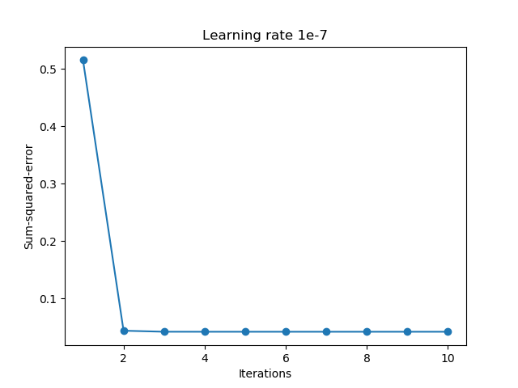

# Assignment 1
Image Decryption by a Single-Layer Neural Network
## 說明
#### 加密公式
 
###### I = 原始圖片 
###### K1, K2 = 加密鑰匙 
###### E = 已加密的圖片 

#### Image Key 1 (K1)

#### Image Key 2 (K2)

#### The Input Image (I)

#### The Encrypted Image (E)

***
## 實作方式
#### Python Imaging Library
  使用PIL讀取圖片每個像素點的數值 
#### Gradient Descent
  定義cost function為 
  為得function之最低點(斜率最接近0的地方)，將之對wj微分 
  
  得到error=(target-output)\*xj 
  因此我們只要將此套入公式應可得cost function的最低點，也就是斜率最接近0的地方 
***
## 實際訓練結果

<table>
  <tr>
    <td colspan="3">
      target = E 
      input = I 
      w初始值 = [0, 0, 0] 
      以下為不同learning rate產生不同的結果
    </td>
  </tr>
  <tr>
    <th>Learning Rate</th>
    <th>Image (w初始值[0,0,0])</th>
    <th>Image (w初始值[1e3,1e3,1e3])</th>
  </tr>
  <tr>
    <td>1e-5</td>
    <td></td>
    <td></td>
  </tr>
  <tr>
    <td>1e-6</td>
    <td></td>
    <td></td>
  </tr>
  <tr>
    <td>1e-7</td>
    <td></td>
    <td></td>
  </tr>
  <tr>
    <td>1e-8</td>
    <td></td>
    <td></td>
  </tr>
  <tr>
    <td>1e-9</td>
    <td></td>
    <td>N/A</td>
  </tr>
</table>

#### W 結果

###### w0 = 0.24948466306990535

###### w1 = 0.6603639149873232

###### w2 = 0.0908177168189841

#### Encryptrd Eprime

#### Decrypted Eprime

## 結果討論

依測試結果，以此例子最適合的learning rate為1e-5 ~ 1e-7之間 
就算我將w的初始值調到1000而或是1e10，在上述區間的learning rate下依然是非常快速的就得到了結果 
我的程式碼跟老師的虛擬碼有點不一樣，在while條件的部分，我是將值設為 epochs < 10 OR average_cost > 0.1  
以利測試在不同learning rate的情況下，所需的iteration是多少

## 參考資料

<http://sebastianraschka.com/Articles/2015_singlelayer_neurons.html>
