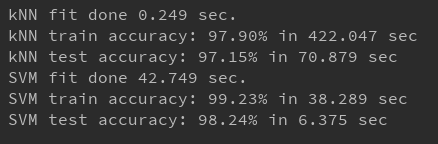

# Assignment 2
Handwritten Digit Recognition
### 說明
先將格式為idx3和idx1的手寫資料下載下來，讀檔後先將numpy array存為npy檔，往後使用從npy讀檔較快。 
idx3讀取後有60000筆手寫資料，28*28的灰階圖像，我先使用PCA擷取特徵值並降低維度至35，接著使用scale將35維的數值標準化。 
這樣我們的訓練資料與測試資料就已經完成預處理了，並使用kNN, SVM兩種機器學習方式進行辨識。
### 桌面環境
Windows 10 
Python 3.6 (sklearn)

### 結果探討
 
kNN由於沒有訓練過程，所以訓練時間非常短，但由於辨識過程需要計算距離，所以辨識時間較長
SVM則是訓練時間較長，但辨識速度較快
就辨識準確率來說我覺得兩個方法差異不大，或許再資料預處理的部分還有再改進的空間，提高維度、或者是其他參數的調整，能讓辨識結果更好。
### 參考資料
<a href="https://www.jianshu.com/p/84f72791806f">使用Python解析MNIST數據集（IDX文件格式）</a>
